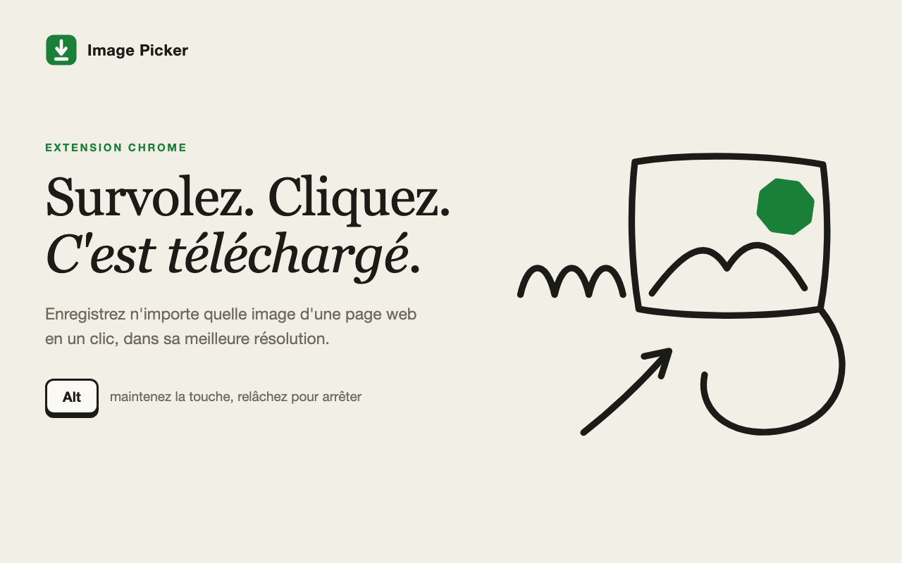
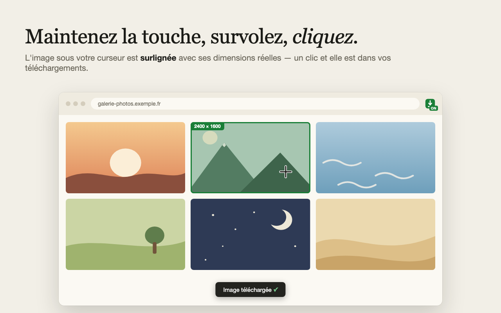
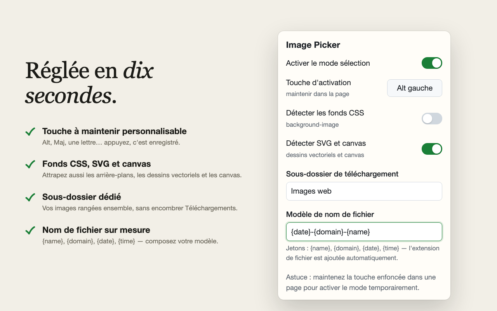
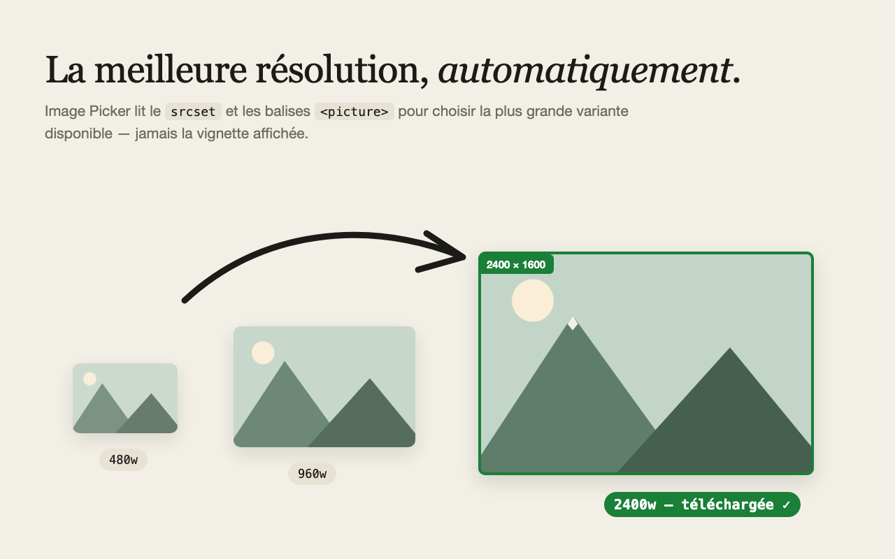

# Image Picker

> Survolez. Cliquez. C'est téléchargé.

Extension Chrome (Manifest V3) pour télécharger n'importe quelle image d'une page web en un clic — dans sa meilleure résolution, rangée où vous voulez.



## Fonctionnalités

- **Touche à maintenir** : maintenez la touche de votre choix (Alt par défaut), le mode sélection s'active ; relâchez, tout redevient normal. Un interrupteur dans le popup permet aussi une activation permanente (badge « ON » sur l'icône).
- **Surlignage au survol** : l'image sous le curseur est encadrée, avec ses dimensions réelles.
- **Meilleure résolution automatique** : lecture du `srcset` et des balises `<picture>` pour télécharger la plus grande variante disponible — jamais la vignette affichée.
- **Clic sans dégât** : une image dans un lien est téléchargée sans déclencher la navigation, la lightbox ou le routeur SPA. Fonctionne aussi dans les iframes.
- **Au-delà des ``** (options) : images de fond CSS (`background-image`), SVG inline (sérialisés en `.svg`), canvas (exportés en `.png`).
- **Rangement sur mesure** : sous-dossier dédié dans Téléchargements et modèle de nom de fichier avec jetons `{name}`, `{domain}`, `{date}`, `{time}`.
- **Zéro collecte** : aucune donnée ne quitte votre machine. Deux permissions : `downloads` et `storage`.



| | |
|---|---|
|  |  |

## Installation

### Manuelle (dès maintenant)

1. Téléchargez le zip de la [dernière release](../../releases/latest) et décompressez-le (ou clonez ce dépôt).
2. Ouvrez `chrome://extensions`, activez le **Mode développeur**.
3. Cliquez **Charger l'extension non empaquetée** et sélectionnez le dossier.

### Chrome Web Store

Publication en cours de validation.

## Utilisation

1. Sur n'importe quelle page, **maintenez la touche** configurée (Alt gauche par défaut).
2. Survolez une image : elle se surligne en vert.
3. **Cliquez** : elle part dans vos téléchargements. Relâchez la touche pour quitter le mode.

## Réglages

Tout se règle depuis le popup de l'extension :

| Réglage | Description | Défaut |
|---|---|---|
| Activer le mode sélection | Activation permanente, sans toucher au clavier | désactivé |
| Touche d'activation | Cliquez le bouton puis pressez une touche (Échap annule) | Alt gauche |
| Détecter les fonds CSS | Cible aussi les `background-image` | désactivé |
| Détecter SVG et canvas | Cible aussi les SVG inline et les `<canvas>` | désactivé |
| Sous-dossier de téléchargement | Relatif à Téléchargements, imbrication possible (`Photos/2026`) | racine |
| Modèle de nom de fichier | Jetons : `{name}`, `{domain}`, `{date}`, `{time}` — extension ajoutée automatiquement | `{name}` |

Les réglages se propagent instantanément aux onglets déjà ouverts (`chrome.storage.sync`).

## Structure du code

| Fichier | Rôle |
|---|---|
| [manifest.json](manifest.json) | Manifest V3 : permissions, content script, service worker, popup |
| [common.js](common.js) | Constantes et helpers partagés (parseur `srcset`, modèle de nom, etc.) |
| [background.js](background.js) | Service worker : téléchargements (`onDeterminingFilename`), badge, relais touche inter-frames |
| [content.js](content.js) | Cœur : gestion de la touche, détection de cible, overlay, interception du clic |
| [content.css](content.css) | Overlay, toast, curseur |
| [popup.html](popup.html) / [popup.css](popup.css) / [popup.js](popup.js) | Interface de réglages |
| [test/](test/) | Suite de tests de bout en bout |

## Tests

Suite e2e pilotée en CDP : Chrome headless charge l'extension (`Extensions.loadUnpacked`), une page locale sert des images de test, la souris et le clavier sont simulés, et 19 assertions vérifient tout le cycle — activation, overlay, meilleure résolution, non-navigation, fonds CSS, SVG, canvas, sous-dossier, modèle de nom, touche maintenue/relâchée.

```bash
./test/run_e2e.sh
```

Prérequis : macOS avec Google Chrome et Node ≥ 22 (WebSocket natif). Le test tourne dans un profil temporaire jetable, les téléchargements sont confinés dans un dossier temporaire.

## Licence

[MIT](LICENSE)
